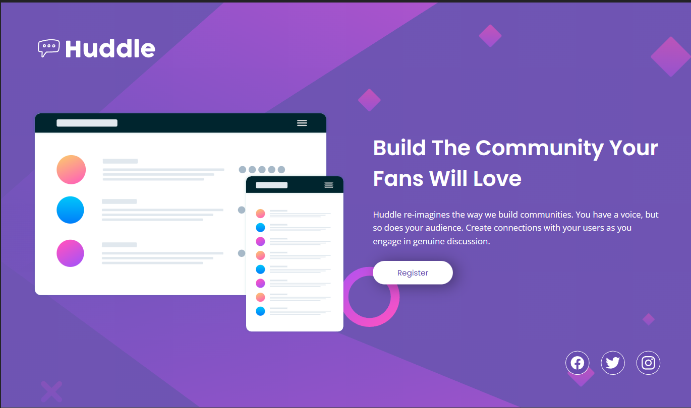
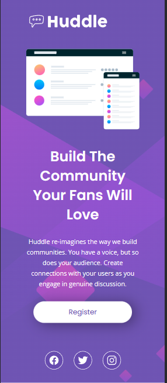

# Huddle-Landing-Page

## Hello Again 👋

For this challenge I had to create a landing page for Huddle, I thoroughly enjoyed coding this project and it had definitely tested my knowledge in CSS Grid, Flexbox and as well as making the landing page responsive to view the optimal layout for the page depending on the users device's screen size. I also included a few basic interactive element on the page!

### Links

- My Live Site URL for this challenge: [Click Here](https://jcasia-huddle-landing-page.netlify.app/)
- My Solution URL for this challenge: [Click here](https://www.frontendmentor.io/solutions/huddle-landing-page-XbOT-VsAbZ)

### Built with

- HTML
- CSS
- SASS
- Flexbox
- CSS Grid

### Some screenshots of this project

